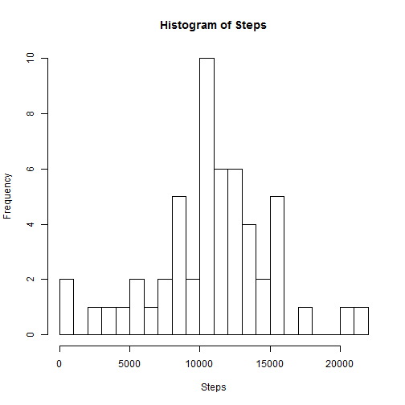
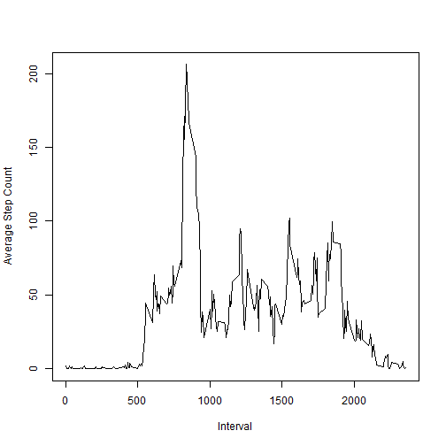
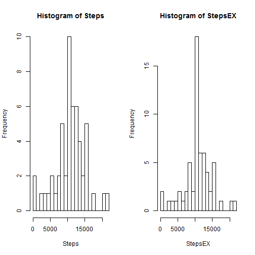
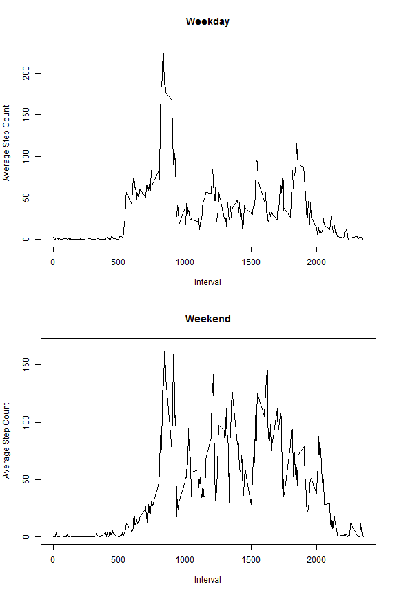

## Loading and preprocessing the data
Unzip the data and load it into memory. I assume we're working out of the RepData_PeerAssessment1 repository where the zip is present in the working directory, but the data is not.


```r
unzip("activity.zip", exdir=".")
activity <- read.csv("activity.csv")
```


## What is mean total number of steps taken per day?
1. Calculate the total number of step taken per day.

```r
Steps <- do.call(rbind,
                 lapply(split(activity, activity$date),
                        function(data){sum(data[, 1])}))
```

2. Make a histogram of the total number of steps taken each day.

```r
hist(Steps, breaks=23)  # I just like 23 and the default didn't seem like enough.
```

 

3. Calculate and report the mean and median of the total number of steps taken per day.

```r
mean(Steps, na.rm=T)
```

```
## [1] 10766.19
```

```r
median(Steps, na.rm=T)
```

```
## [1] 10765
```


## What is the average daily activity pattern?
1. Time series plot of the 5-minute intervals and the average number of steps taken, averaged across all days with data.

```r
daysWithData <- length(Steps) - sum(is.na(Steps[, 1]))
intervalData <- do.call(rbind,
                        lapply(split(activity, activity$interval),
                               function(data){
                                 c(data[1, 3],
                                   sum(data[, 1], na.rm=T) / daysWithData)}))
plot(intervalData, type='l', ylab="Average Step Count", xlab="Interval")
```

 

2. Which 5-minute interval, on average across all the days in the dataset, contains the maximum number of steps?

```r
maxStepIntervalIndex <- match(max(intervalData[, 2]), intervalData[,2])
cat("Max step interval", intervalData[maxStepIntervalIndex, 1], "has", intervalData[maxStepIntervalIndex, 2], "steps on average.")
```

```
## Max step interval 835 has 206.1698 steps on average.
```


## Imputing missing values
Note that there are a number of days/intervals where there are missing values (coded as NA). The presence of missing days may introduce bias into some calculations or summaries of the data.

1. Calculate and report the total number of missing values in the dataset (i.e. the total number of rows with NAs).

```r
totalRows <- dim(activity)[1]
missingRows <- sum(is.na(activity[, 1]))
cat("There are", totalRows, "rows in total with", missingRows, "rows missing.")
```

```
## There are 17568 rows in total with 2304 rows missing.
```

2. Devise a strategy for filling in all of the missing values in the dataset. The strategy does not need to be sophisticated. For example, you could use the mean/median for that day, or the mean for that 5-minute interval, etc.

From my cursory glance at the data, it looks like entire days go missing so using a mean/median for that day doesn't make sense. Integer steps derived by exploiting some assumed structure in the participant's day-of-the-week routine would make the most sense, but I already have interval average calculated so I'm just going to go with that.

3. Create a new dataset that is equal to the original dataset but with the missing data filled in.

```r
# Get all the intervals in a day and put them in a vector so we can translate from factors to indices or vice versa.
intervals <- activity[activity$date == "2012-10-01", "interval"]
meanReplace <- function(data) {
  if (is.na(data[1])) {  # Replace step count with average if NA.
    c(intervalData[[match(as.numeric(data[3]), intervals), 2]], data[2:3])
    } else {
      data
      }
  }
activityEX <- apply(activity,
                    1,
                    meanReplace)

# R data structures make no sense, so just manually fix everything that broke.
# Since R can't make up its mind on treating intervals as factors or ints, just roll with it.
activityEX <- as.data.frame(t(activityEX))
names(activityEX) <- names(activity)
activityEX <- within(activityEX, steps <- as.numeric(as.character(steps)))
activityEX <- within(activityEX, date <- as.Date(date, format="%Y-%m-%d"))
```

4. Make a histogram of the total number of steps taken each day then calculate and report the mean and median total number of steps taken per day. Do these values differ from the estimates from the first part of the assignment? What is the impact of imputing missing data on the estimates of the total daily number of steps?

```r
StepsEX <- tapply(activityEX$steps, activityEX$date, sum)

par(mfrow=c(1, 2))
hist(Steps, breaks=23)
hist(StepsEX, breaks=23)
```

 

```r
original <- c(mean(Steps, na.rm=T), median(Steps, na.rm=T))
EX <- c(mean(StepsEX, na.rm=T), median(StepsEX, na.rm=T))
data.frame(original, EX, row.names=c("mean", "median"))
```

```
##        original       EX
## mean   10766.19 10766.19
## median 10765.00 10766.19
```
Since entire days are missing and the impute strategy sets them all up with averages for each interval, the total steps for these days are all the same. So, the effect of filling in new days bumps the histogram value for that particular count up by those days. There's no change in the means or medians, but admittedly this is what I would expect from my lazy impute strategy. A more sophisticated approach would probably yield some difference between the two, though I doubt any reasonable method would result in any significant bias. The method I chose is just obviously bad on this histogram.

## Are there differences in activity patterns between weekdays and weekends?
1. Create a new factor variable in the dataset with two levels - "weekday" and "weekend" indicating whether a given date is a weekday or weekend day.


```r
weekendDays <- c("Sunday", "Saturday")
activityEX <- within(activityEX,
                     weekpart <- as.factor(ifelse(weekdays(date) %in% weekendDays,
                                                  "weekend", "weekday")))
```

2. Make a panel plot containing a time series plot (i.e. type = "l") of the 5-minute interval (x-axis) and the average number of steps taken, averaged across all weekday days or weekend days (y-axis). See the README file in the GitHub repository to see an example of what this plot should look like using simulated data.

```r
par(mfrow=c(2, 1))

byWeekpart <- split(activityEX, activityEX$weekpart)


IDDC <- length(unique(byWeekpart[[1]]$date))
IDD <- do.call(rbind,
               lapply(split(byWeekpart[[1]], byWeekpart[[1]]$interval),
                      function(data){
                        c(intervals[data[1, 3]],
                          sum(data[, 1]) / IDDC)}))

IDEC <- length(unique(byWeekpart[[2]]$date))
IDE <- do.call(rbind,
               lapply(split(byWeekpart[[2]], byWeekpart[[2]]$interval),
                      function(data){
                        c(intervals[data[1, 3]],
                          sum(data[, 1]) / IDEC)}))


plot(IDD, type='l', ylab="Average Step Count", xlab="Interval", main="Weekday")
plot(IDE, type='l', ylab="Average Step Count", xlab="Interval", main="Weekend")
```

 
